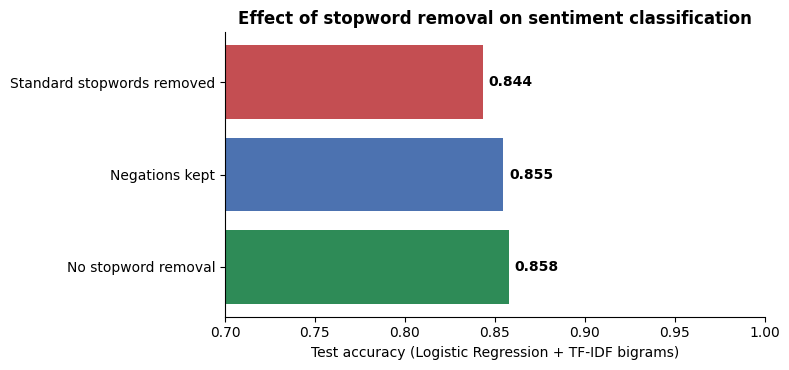
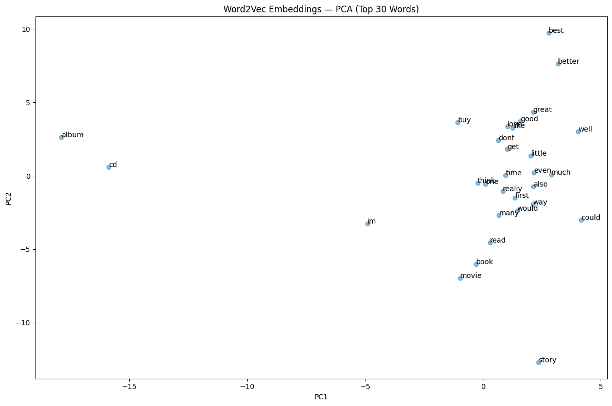

# 🧠 End-to-End NLP & LLM Project — Amazon Reviews

[](https://colab.research.google.com/github/MMujtabaX/nlpllm/blob/main/NLP_LLM_Complete_Project.ipynb)


A complete tour of the NLP stack, from raw text to transformers, on **20,000 Amazon product reviews**. The project covers **6 parts and 12 tasks**: cleaning and normalization, n-grams and vectorization, Word2Vec embeddings, n-gram language models, generative AI with transformer models, prompt engineering, and sentiment classification, plus an experiment testing whether stopword removal hurts sentiment analysis.

<p align="center">
  
</p>
<p align="center"><sub>Removing standard stopwords deletes "not" and "no", and costs accuracy. Keeping negations recovers most of it.</sub></p>

## 🗺️ Project Map

| Part | Task | What's done |
|------|------|-------------|
| 🔵 **1. Text Processing** | 1. Cleaning | Lowercasing, punctuation and number removal |
| | 2. Tokenization & stopwords | NLTK tokenization, plus a negation-safe stopword list |
| | 3. Stemming vs lemmatization | Porter vs WordNet comparison |
| 🟢 **2. Representation** | 4. N-grams | Top unigrams, bigrams and trigrams |
| | 5. Vectorization | Bag of Words vs CountVectorizer vs TF-IDF |
| 🟡 **3. Embeddings** | 6. Word2Vec | Training, similar words, analogies |
| | 7. Visualization | PCA projection of embeddings |
| 🟠 **4. Language Models** | 8. N-gram LM | Unigram and bigram next-word probabilities |
| | 9. Mini-LLM design | Tokenizer → embeddings → transformer → softmax |
| 🔴 **5. Generative AI** | 10. LLM capabilities | Text generation, summarization, question answering |
| | 11. Prompt engineering | Role, format constraints, delimiters |
| 🟣 **6. Classification** | 12. Discriminative vs generative | Logistic Regression, SVM, Naive Bayes |

## 📊 Key Results

### Sentiment classification (4,000 test reviews)

| Model | Type | Features | Accuracy |
|-------|------|----------|----------|
| **Logistic Regression** | Discriminative | TF-IDF | **83.3%** |
| Linear SVM | Discriminative | TF-IDF | 81.3% |
| Naive Bayes | Generative | Counts | 81.2% |

### 🔬 Does stopword removal hurt sentiment analysis?

Task 2 noted that NLTK's stopword list contains **"not"**, **"no"** and **"nor"**, so *"not good"* becomes *"good"*. The same Logistic Regression + TF-IDF (bigram) model, trained on three versions of the text:

| Text preprocessing | Accuracy |
|--------------------|----------|
| Standard stopwords removed | 84.4% |
| **Negations kept** (*not, no, nor, never, very, too…*) | **85.5%** |
| No stopword removal | 85.8% |

Standard stopword removal **costs 1.4 points**. Keeping just the negation words recovers most of the loss, which confirms that "remove stopwords" shouldn't be applied blindly in sentiment tasks.

### Word2Vec on 20K reviews

| Query | Most similar words |
|-------|-------------------|
| guitar | riffs, bass, drums, guitars, vocals |
| quality | crisp, grainy, workmanship |
| good − bad + book | **informative**, introduction, readers |

Domain-trained vectors capture product language well (*guitar* → instruments, *quality* → picture and build quality). Classic analogies like *king − man + woman* fail, because product reviews rarely talk about royalty. Embeddings only know the contexts they were trained on.

<p align="center">
  
</p>

### Corpus insights (n-grams)

| Top bigrams | Top trigrams |
|-------------|--------------|
| read book (672) | **dont waste money** (119) |
| would recommend (395) | pampers baby dry (77) |
| waste money (328) | dont waste time (72) |
| highly recommend (300) | would recommend book (63) |

The most frequent phrases are strong **sentiment signals** (*"waste money"*, *"highly recommend"*), which is why bigrams help the classifier.

### Language models

**Bigram LM:** P(*quality* | *sound*) = 0.10, the most likely word after "sound" in product reviews.

**Transformer models (Task 10):**

| Task | Model | Result |
|------|-------|--------|
| Text generation | distilGPT-2 | Fluent but repetitive continuation of *"This guitar has an amazing sound and…"* |
| Summarization | DistilBART-CNN | Mostly extractive: it stitched together sentences from the review |
| Question answering | DistilBERT-SQuAD | *"What does the reviewer like?"* → **"The music is timeless"** |

Question answering is implemented directly with `AutoModelForQuestionAnswering`: the model scores every token as a possible answer start and end, and the code picks the best-scoring span. (Recent `transformers` versions removed the `question-answering` pipeline shortcut.)

## 🚀 Run It

Click the **Open in Colab** badge above and choose **Runtime → Run all**. The dataset streams from Hugging Face and the transformer models download automatically; a CPU runtime is enough. Change `N_REVIEWS` in the loading cell to use more or fewer reviews.

```bash
pip install nltk gensim scikit-learn pandas numpy matplotlib seaborn wordcloud datasets transformers torch
```

## ⚠️ Limitations

- The 20,000 reviews are the **first** 20K of the dataset's training split, not a random sample, so they lean toward the product categories listed first (books, music, movies).
- distilGPT-2 and DistilBART are small models chosen to run on a CPU. Larger models produce far better generation and summaries.
- Prompt engineering (Task 11) designs prompts but doesn't evaluate them against an LLM.

## 🔮 Next Steps

- Fine-tune DistilBERT for sentiment classification and compare against TF-IDF + Logistic Regression
- Run the Task 11 prompts against a local LLM (Ollama) and measure classification accuracy
- Use a random sample across the full 3.6M-review dataset

## 👤 Author

**Muhammad Mujtaba Khan Suri** — CS @ UBIT, University of Karachi
[GitHub](https://github.com/MMujtabaX)
